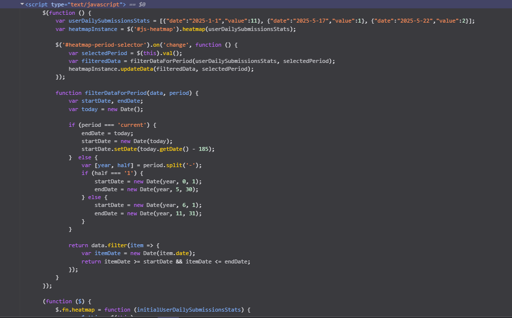

# CodeSphere

How I am building this?

#Routing in my project-management

In Next.js, routing is based on file or folder structure, meaning each file inside the `pages` or `app` directory automatically becomes a route. However, I prefer code-based routing because with folder-based routing, I need to carefully manage the directory structure, file names, and nesting to ensure the correct routes are generated. Code-based routing gives me more flexibility and control, allowing me to define routes programmatically, handle dynamic parameters, and implement custom logic for navigation and access control. This approach can make the routing logic more explicit and maintainable, especially as the project grows in complexity.

## Why I Use Hono.js for API Routes

[Hono.js](https://hono.dev/) is a lightweight, fast, and modern web framework for building APIs and serverless functions in JavaScript and TypeScript. It is designed to be minimal yet powerful, making it an excellent choice for Next.js projects that need custom API endpoints.

### Why Hono.js?

- **Performance:** Hono.js is extremely fast and has a tiny footprint, which is ideal for serverless environments like Vercel or Cloudflare Workers.
- **Simplicity:** Its API is minimal and easy to learn, allowing you to define routes and middleware with very little boilerplate.
- **TypeScript Support:** Hono.js is built with TypeScript in mind, providing excellent type safety and autocompletion.
- **Middleware Ecosystem:** It supports a growing ecosystem of middleware for things like authentication, validation, and CORS.
- **Compatibility:** Hono.js works seamlessly with modern deployment platforms and can be used as a handler for Vercel, Cloudflare, and more.

### Why Hono.js is Better (for my use case)

- **Better Developer Experience:** Compared to the built-in Next.js API routes, Hono.js offers a more expressive and flexible routing system, similar to frameworks like Express but with a much smaller bundle size.
- **Cleaner Code:** Route definitions are clear and concise, making the API layer easier to maintain and scale.
- **Advanced Routing:** Hono.js supports features like route parameters, nested routes, and middleware chaining out of the box.
- **Optimized for Serverless:** Its design is optimized for serverless platforms, ensuring fast cold starts and low latency.

In summary, Hono.js helps me build robust, maintainable, and high-performance APIs in my Next.js project with minimal overhead and maximum flexibility.